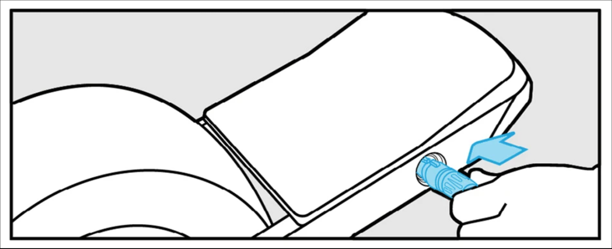

# Charge Hub

A project to help people find publically accessible charging across the world. Specifically aimed at personal electric transport.

At the core of the idea is a crowd source database of available charging sockets.



## Fact Sheet

| Key              | Value               |
| ---------------- | ------------------- |
| Live URL         | _To be implemented_ |
| Dev URL          | _To be implemented_ |
| UI Framework     | Vue.js              |
| Database         | _To be implemented_ |
| CI               | _To be implemented_ |
| Firebase Project | _To be implemented_ |

## CI

This project will use github actions to automate deployment to live and development URLs based off of the `main` and `development` branches respectively.

We use firebase to host the static builds.

## UI Development

1. Ensure you are up to date with the latest code from the development branch.

    ```bash
    git checkout development
    git pull
    ```

1. Checkout a new branch with your changes on it

    ```bash
    git checkout -b feat/my-amazing-new-feature
    ```

1. Install NPM dependencies

    ```bash
    npm install
    ```

1. Run the UI locally and make / test any changes

    ```bash
    npm run serve
    ```

1. Ensure your branch is still up to date with development

    ```bash
    git pull origin development
    ```

1. Create a PR explaining what you've changed 🦸

## Database

We will use Firestore for the database, it's not yet implemented.
